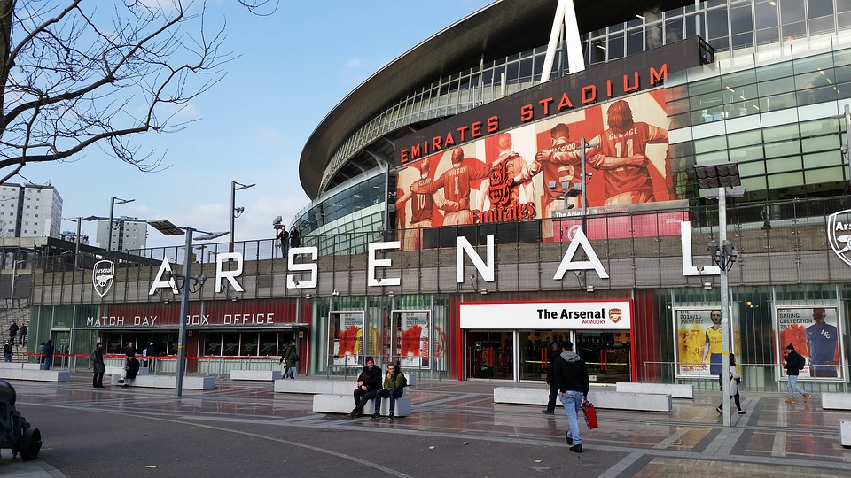

# IASC 2P02 | Greg Osagie

## Bio

Gregory is an Interactive Arts and Science undergraduate student at the University of Brock who is currently in his second (2nd) year of the program. Under his I.A.S.C degree he has two (2) cocentrations and focuses:

His Concentrations include: Digital Expression and Digital Prototyping. His Focuses include: Artificial Intelligence and Web & Internet Technologies.

[Arsenal Stadium](https://en.wikipedia.org/wiki/Arsenal_F.C.)

He is a massive fan of Arsenal Football Club and he plays intramural soccer on campus at Brock University.

## Featured Project

## Collaborative Project

["Title"](link)

## Research Presentation

["Title"](reveal/index.html) 

## Academic Blog

["Title"](link)

Click on the link below to read my recently posted blog on Digital Humanities

[continue reading](officialosagie.github.io/blog)

